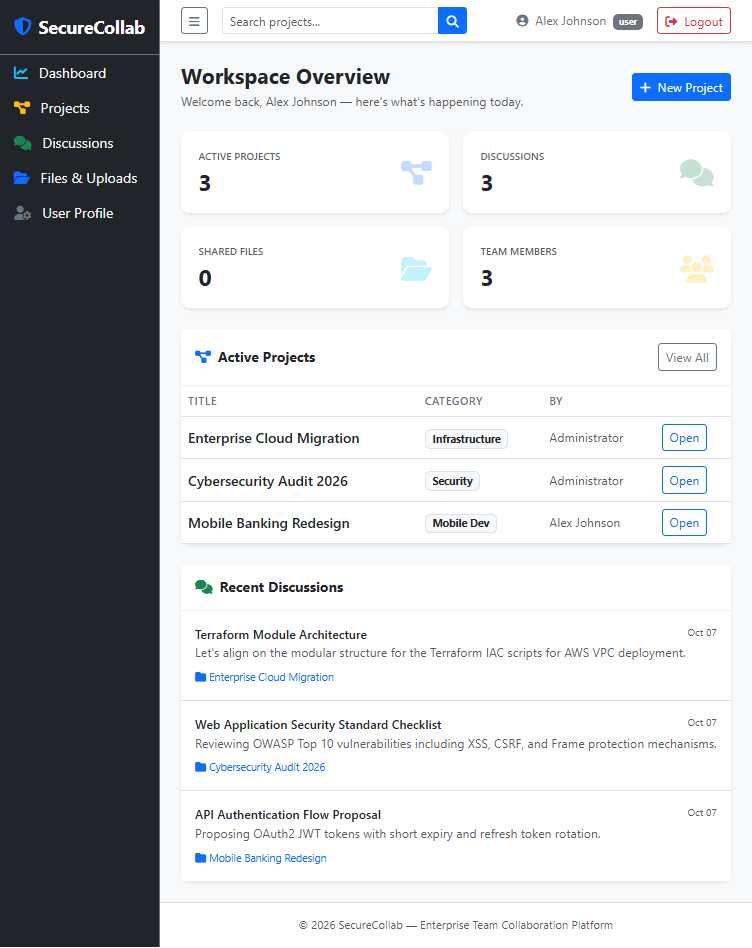

# SecureCollab

SecureCollab is a PHP and MySQL team-collaboration application paired with an intentionally vulnerable version for hands-on web security demonstrations. Compare the vulnerable behavior with the corresponding mitigations in the secure app.

> **Local training lab only.** The vulnerable app is deliberately unsafe. Run it only on a trusted local XAMPP installation with demo data; do not expose it to the internet or use real credentials or personal information.

## Dashboard



The screenshot shows the secure app's workspace dashboard.

## Apps

| Version | Local URL | Purpose |
| --- | --- | --- |
| Vulnerable | <http://localhost/securecollab-vulnerable/> | Demonstrates intentionally vulnerable behavior |
| Secure | <http://localhost/securecollab-secure/> | Shows defensive implementations |

Both apps share the `securecollab` database. Their user interfaces and sample data are designed to make side-by-side demonstrations straightforward.

## Security demonstrations

| Demonstration | Vulnerable app | Secure app |
| --- | --- | --- |
| Reflected XSS | Project search reflects input into the page | HTML-encodes output with `htmlspecialchars()` |
| Stored XSS | Discussion comments render untrusted HTML | HTML-encodes comments when rendered |
| DOM-based XSS | Preview JavaScript inserts input with `innerHTML` | Preview JavaScript uses `textContent` |
| SQL injection | Login query concatenates input into SQL | Login uses a parameterized PDO query |
| CSRF | Email-change request lacks token validation | Email-change request validates a session token |
| Clickjacking | Project archive action lacks the secure app's frame protections | Uses frame protections such as `X-Frame-Options` and CSP |

For the step-by-step demonstration flow and example payloads, see the [faculty demo guide](securecollab-secure/FACULTY_DEMO.md).

## Requirements

- Windows with [XAMPP](https://www.apachefriends.org/)
- Apache and MySQL/MariaDB enabled in the XAMPP Control Panel
- PHP 8.x (included with XAMPP)

The sample database configuration uses the standard XAMPP MySQL account `root` with a blank password. If your local MySQL credentials differ, update `config/database.php` in **both** app folders.

## Install locally

1. Clone this repository somewhere outside `htdocs`, for example:

   ```powershell
   git clone https://github.com/HARI24VEDHA/SecureCollab.git C:\xampp\SecureCollab
   ```

2. Copy both app folders into `htdocs` so they are siblings:

   ```powershell
   Copy-Item C:\xampp\SecureCollab\securecollab-secure,C:\xampp\SecureCollab\securecollab-vulnerable C:\xampp\htdocs -Recurse
   ```

   The resulting paths should be `C:\xampp\htdocs\securecollab-secure` and `C:\xampp\htdocs\securecollab-vulnerable`. The app base URLs expect these folder names at the `htdocs` root.

3. In the XAMPP Control Panel, start **Apache** and **MySQL**.

4. Initialize the sample database once by opening <http://localhost/securecollab-vulnerable/database/setup_db.php>. The secure and vulnerable apps share this database. **Running the setup script again drops and recreates the sample tables, replacing existing lab data.**

5. Open either app URL from the table above and sign in.

## Demo accounts

| Role | Email | Password |
| --- | --- | --- |
| Administrator | `admin@securecollab.local` | `SecureDemo!2026` |
| User | `user@securecollab.local` | `SecureDemo!2026` |
| Team lead | `sarah@securecollab.local` | `SecureDemo!2026` |

These are public sample credentials for local demonstrations only.
